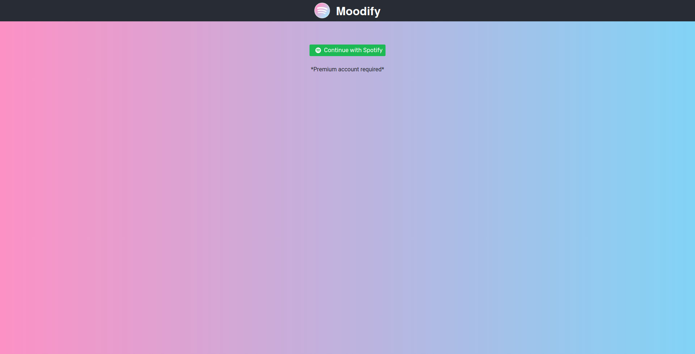
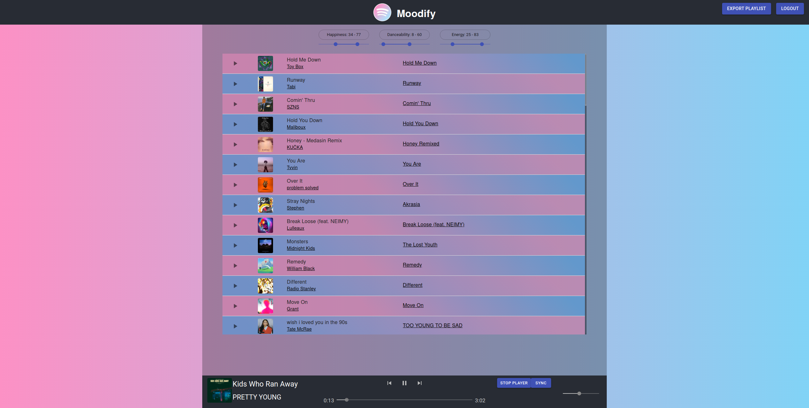
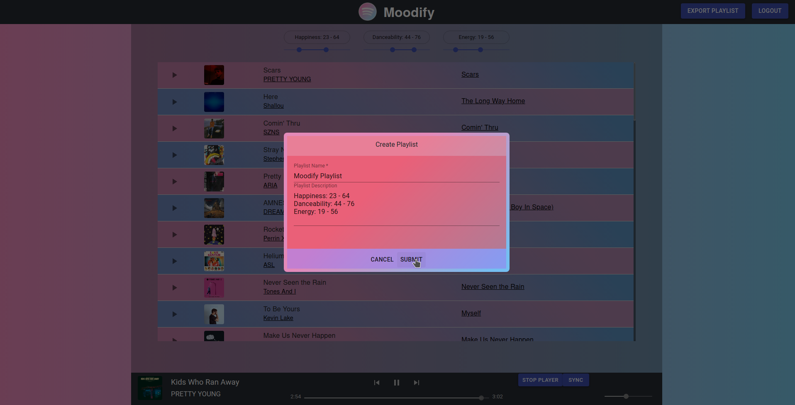
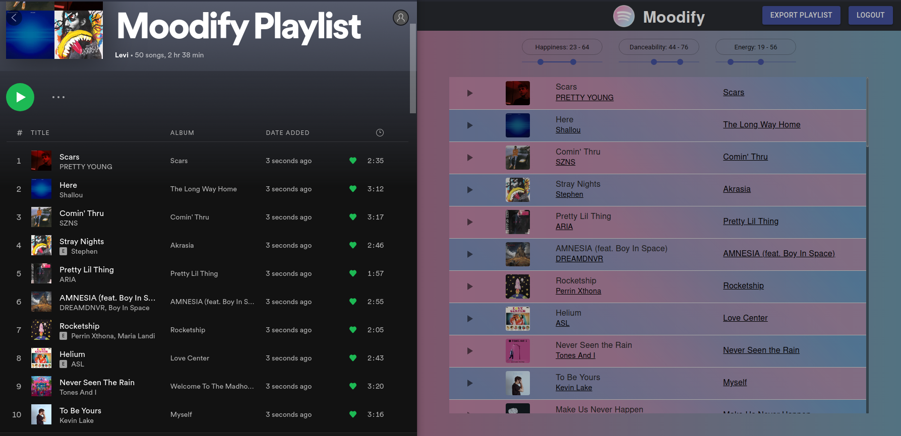

# Moodify

[Moodify.Party](https://Moodify.party)

## Home

Log into your Spotify Premium account to continue. (Project currently in development mode so unapproved accounts will not work.)

## Sort your liked songs based on mood

Specify a range for each mood to output a list of songs that fit your current mood.

## Export Playlists

Your filtered playlists exported directly to your account.